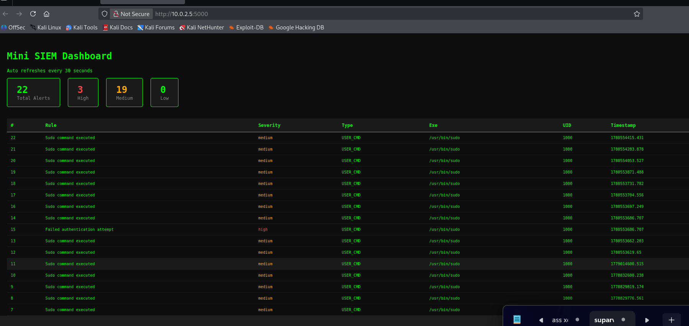

# Mini SIEM System

A custom-built Security Information and Event Management (SIEM) system built from scratch in Python — no Splunk, no Elastic, no shortcuts. Every component was designed and implemented manually to deeply understand how enterprise SIEMs work under the hood.

---

## Why I built this

Most cybersecurity students learn SIEM by clicking buttons in Splunk. I wanted to understand what Splunk is actually doing underneath — how raw logs become structured data, how detection rules fire, how alerts get stored and visualized. So I built it myself.

---

## How it works

Raw logs from a Kali Linux machine flow through a pipeline:

Audit Logs → Collector → Normalizer → Detection Engine → Database → Dashboard

1. **Collector** reads raw lines from /var/log/audit/audit.log
2. **Normalizer** parses each line into structured fields (type, timestamp, uid, exe, hostname, result)
3. **Detection Engine** runs rules against normalized entries and fires alerts on suspicious patterns
4. **Alerter** persists every fired alert to SQLite
5. **Dashboard** displays live alerts in a browser with severity breakdown and auto-refresh

---

## Detection Rules

| Rule | Trigger | Severity |
|------|---------|----------|
| Sudo command executed | Any USER_CMD audit event | Medium |
| Failed authentication | Failed USER_AUTH or USER_LOGIN event | High |
| Brute force detected | 5+ failed logins within 60 seconds | Critical |

---

## Dashboard

---

## Project Structure

collectors/ — Pulls raw logs from log sources

normalizer/ — Parses raw lines into structured dicts

detection/ — Threat detection rules engine

alerting/ — Saves alerts to SQLite database

dashboard/ — Flask web UI for live monitoring

data/ — SQLite database (gitignored)

config.py — Central configuration

---

## How to run

Step 1 - Install dependencies

    pip install flask

Step 2 - Collect logs and populate database

    sudo python3 test_alerter.py

Step 3 - Start the dashboard

    sudo python3 -m dashboard.app

Step 4 - Open in browser

    http://localhost:5000

---

## Tech Stack

- Language: Python 3
- Database: SQLite
- Dashboard: Flask
- Log Source: Linux Audit Daemon (auditd)
- Environment: Kali Linux VM

---

## What I learned

- How raw audit logs are structured and what each field means
- How normalization works — turning unstructured text into queryable data
- How sliding window algorithms detect patterns like brute force
- How a pipeline architecture separates concerns cleanly

---

## Roadmap

- [ ] Windows Event Log collection
- [ ] Splunk integration for comparison
- [ ] More detection rules (privilege escalation, port scanning)
- [ ] Email and Slack alerting on critical severity
